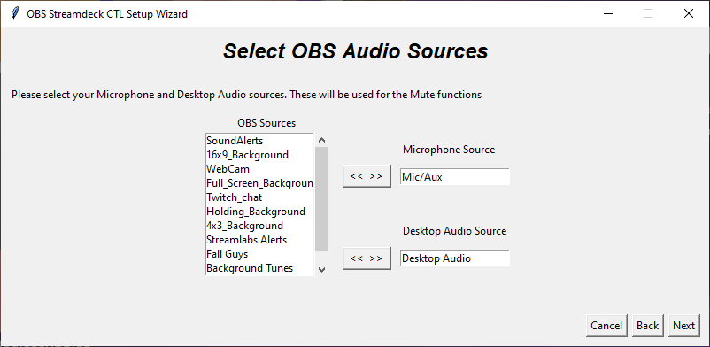

################
First Time Setup
################

.. include:: ../../README.rst
   :start-after: Using
   :end-before: Using the Scripts

Setup Wizard
************

Initial Page
^^^^^^^^^^^^

If you haven't already installed OBS Websockets, the Setup Wizard will take
you to their download page.

Pre-Existing Configuration Check
^^^^^^^^^^^^^^^^^^^^^^^^^^^^^^^^

If you have already created a configuration file the following screen appears.

OBS WebSockets Password
^^^^^^^^^^^^^^^^^^^^^^^

If you configured OBS WebSockets server with a password, please provide it on
this screen. **Please make sure that you have OBS open and OBS WebSockets
server configured before pressing next**

Audio Sources
^^^^^^^^^^^^^

To use the Mute functions, select your Microphone and Desktop audio sources.
The default sources will be automatically selected, but you can replace these
with alternate sources if required.

Overlay Sources
^^^^^^^^^^^^^^^

For the Live Safety function, select the browser overlay sources from OBS that
you would wish to disable when enabling Live Safety.

Twitch Authorisation
^^^^^^^^^^^^^^^^^^^^

The Live Safety features requires you to authorise the OBS Streamdeck CTL
program to use your account.  Add your channel name to the box and click next
to launch a new Web Browser tab and log into Twitch.  Once the sign in is
complete, return to the Setup Wizard.

Offline Safety Features
^^^^^^^^^^^^^^^^^^^^^^^

If you wish to enable offline safety features for your chat channel using the
Start/Stop function, use this screen to select the required features.

Live Safety Features
^^^^^^^^^^^^^^^^^^^^

For the Live Safety function for your chat channel, select the required
features.

Additional Live Safety Features
^^^^^^^^^^^^^^^^^^^^^^^^^^^^^^^

You may also enable additional features for the Live Safety function

Save Configuration
^^^^^^^^^^^^^^^^^^

The Setup Wizard is now complete, click Finish to save your configuration.

